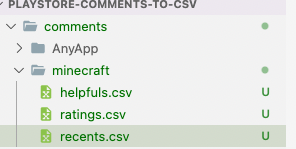
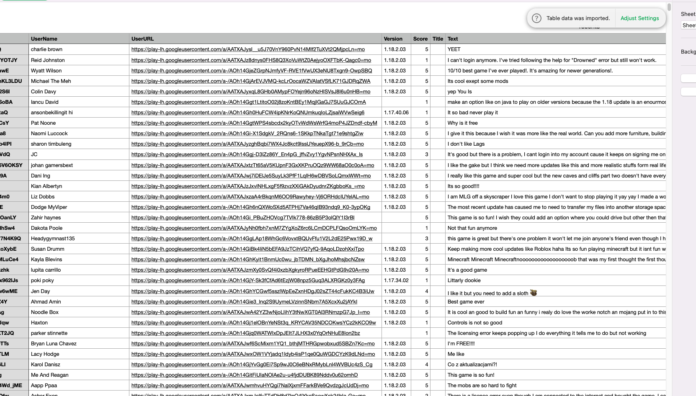

### Install

```bash
npm install playstore-comments-to-csv
```

### Description

- all comments will be collected from app store and generate `csv` files.
- Two types of collection files.
  - Helpful
  - Recent
  - Rating

### Usage

```jsx
const {
  collectPlayStoreComments,
  generateCommentsJSON,
} = require("playstore-comments-to-csv");

// arg1 => name of directory which will contain csv files
// arg2 => app bundle id
// arg3 => number of comments upto 3000
collectPlaystoreComments("minecraft", "com.mojang.minecraftpe", 3000);

// arg1 => bundle id
// arg2 => number of comments upto 3000
// arg3 => sort, HELPFULNESS | RATING | NEWEST
const helpfulComments = await generateCommentsJSON(
  "com.mojang.minecraftpe",
  3000,
  "HELPFULNESS"
);
const ratingsComments = await generateCommentsJSON(
  "com.mojang.minecraftpe",
  3000,
  "RATING"
);
const newestComments = await generateCommentsJSON(
  "com.mojang.minecraftpe",
  3000,
  "NEWEST"
);
```

### Output




